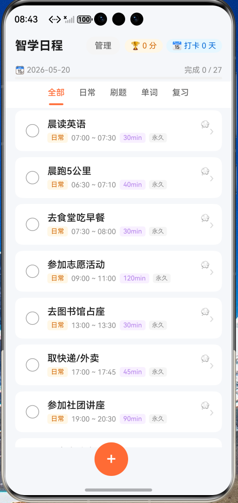
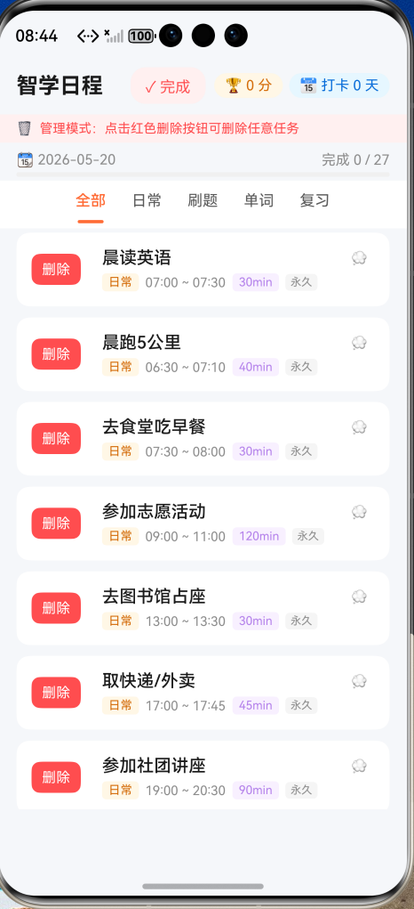
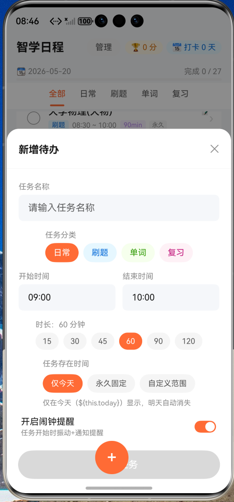
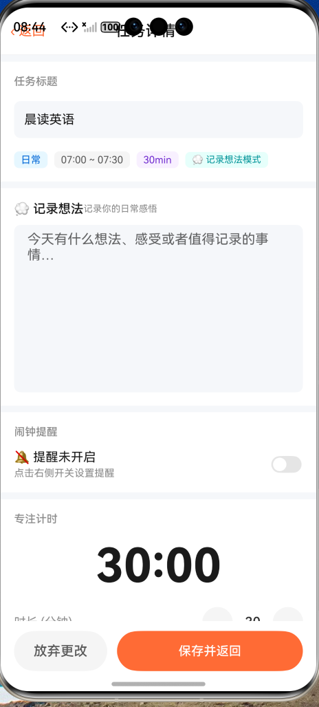
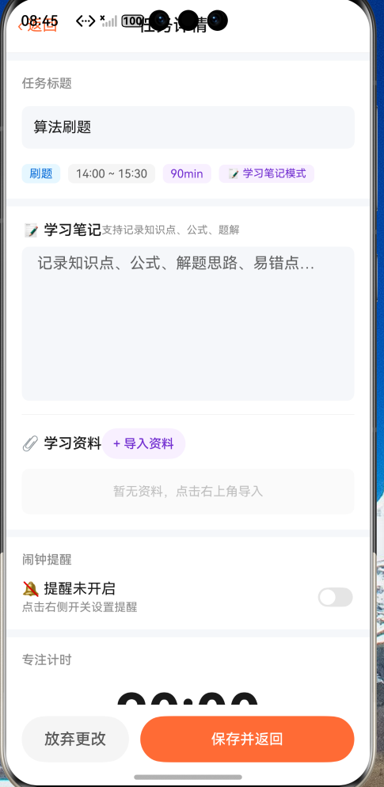
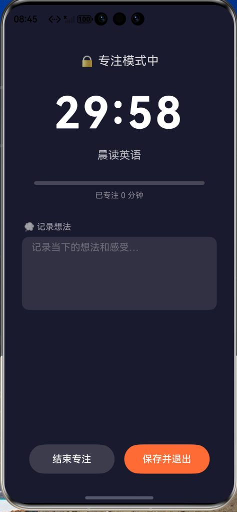

# 智学日程 · SmartStudy Schedule

> 专为大学生打造的 HarmonyOS 学习待办与专注管理 App  
> 基于华为官方 Codelab 待办列表示例二次深度开发

[](https://developer.huawei.com)
[](https://developer.huawei.com/consumer/cn/arkts/)
[](https://developer.huawei.com/consumer/cn/deveco-studio/)
[](LICENSE)

---

## 📖 项目简介

**智学日程（SmartStudy Schedule）** 是一款面向大学生日常学习生活场景深度定制的鸿蒙原生 App。  
项目在华为官方 Codelab 待办清单示例的基础上，进行了系统性的功能扩展与 UI 重设计，覆盖多分类待办管理、自定义任务新增与删除、专注计时锁机、学习笔记分类、闹钟振动提醒、积分打卡激励等核心场景，帮助大学生高效规划日常事务与学习任务。

---

## 🖼 效果展示

<table>
  <tr>
    <td align="center">
      
      <br/><sub><b>主页 · 多分类任务列表</b></sub>
    </td>
    <td align="center">
      
      <br/><sub><b>管理模式 · 一键删除任务</b></sub>
    </td>
    <td align="center">
      
      <br/><sub><b>新增待办 · 灵活配置</b></sub>
    </td>
  </tr>
  <tr>
    <td align="center">
      
      <br/><sub><b>日常任务 · 记录想法</b></sub>
    </td>
    <td align="center">
      
      <br/><sub><b>学习任务 · 笔记+资料</b></sub>
    </td>
    <td align="center">
      
      <br/><sub><b>锁机专注 · 沉浸计时</b></sub>
    </td>
  </tr>
</table>

---

## ✨ 功能亮点

### 1. 多分类待办管理

将任务划分为**日常 / 刷题 / 单词 / 复习**四大类，支持顶部 Tab 一键切换，每个分类均预置了符合大学生生活场景的典型任务（晨跑、高数习题、四六级词汇、专业课巩固等）。

<table>
  <tr>
    <td align="center">
      
      <br/><sub>▲ 主页 · 全部任务列表，Tab 分类切换，进度条实时更新</sub>
    </td>
    <td align="center">
      
      <br/><sub>▲ 管理模式 · 任意任务均可一键删除，附二次确认保护</sub>
    </td>
  </tr>
</table>

---

### 2. 自定义任务新增 · 灵活存在时间

点击右下角 **+** 按钮从底部弹出新增面板，支持设置：

- 任务名称、分类、开始/结束时间、时长
- **存在时间三档可选**：
  - 📅 **仅今天** — 仅当日显示，次日自动消失
  - 🔁 **永久固定** — 每天均显示，直到手动删除
  - 📆 **自定义日期范围** — 指定开始与结束日期，精准控制任务周期

<div align="center">
  
  <br/>
  <sub>▲ 新增待办 · 分类、时间、时长、存在周期、闹钟提醒一站式配置</sub>
</div>

---

### 3. 任务删除管理

点击右上角**「管理」**按钮进入管理模式，顶部出现红色提示条，所有任务卡片左侧显示红色**「删除」**按钮，点击后弹出二次确认弹窗，防止误删。删除任务时关联的闹钟提醒也会同步取消。

---

### 4. 笔记分类 · 学习 vs 日常智能切换

根据任务类型自动切换笔记模式：

| 任务类型 | 笔记模式 | 功能 |
|---------|---------|------|
| 刷题 / 单词 / 复习 | 📝 学习笔记模式 | 学习笔记文本框 + 📎 学习资料导入区 |
| 日常 | 💭 记录想法模式 | 日记式想法记录文本框 |

<table>
  <tr>
    <td align="center">
      
      <br/><sub>▲ 日常任务 · 「记录想法」模式</sub>
    </td>
    <td align="center">
      
      <br/><sub>▲ 学习任务 · 「学习笔记+导入资料」模式</sub>
    </td>
  </tr>
</table>

---

### 5. 专注计时 · 锁机沉浸模式

<div align="center">
  
  <br/>
  <sub>▲ 锁机专注模式 · 深色全屏沉浸，进度可视化，支持专注中记录笔记</sub>
</div>

支持快捷时长（15 / 25 / 45 / 60 分钟）、自定义时长，**🔒 锁机专注**进入全屏深色沉浸界面，屏蔽干扰，专注结束自动标记完成。

---

### 6. 闹钟振动提醒

基于 HarmonyOS `reminderAgentManager` 代理提醒，**App 退出后提醒依然有效**，支持振动 + 通知双重提醒，任务详情页可精确调整提醒时间。

---

### 7. 学习积分 · 打卡激励

| 行为 | 积分奖励 |
|------|---------|
| 完成日常任务 | +5 分 |
| 完成学习类任务（刷题/单词/复习） | +10 分 |
| 每日首次打卡 | +20 分 |

积分与打卡天数实时显示在顶部，基于 `AppStorage` 持久化存储，重启 App 后数据不丢失。

---

## 🛠 技术栈

| 技术 | 说明 |
|------|------|
| **开发语言** | ArkTS（HarmonyOS 声明式语法） |
| **开发工具** | DevEco Studio 6.0+ |
| **目标系统** | HarmonyOS 5.0+ |
| **UI 范式** | 声明式 UI，`@Component` / `@Entry` / `@Builder` |
| **状态管理** | `@State` / `@StorageProp` / `AppStorage` |
| **页面路由** | `@ohos.router` |
| **本地提醒** | `@ohos.reminderAgentManager`（代理提醒，后台有效） |
| **数据持久化** | `AppStorage.SetOrCreate` |

---

## 📁 项目结构

```
entry/src/main/ets/
├── entryability/
│   ├── EntryAbility.ets      # 应用入口，初始化 AppStorage
│   └── Task.ets              # 任务数据模型（Task / TaskParams）
└── pages/
    ├── ToDoListPage.ets      # 主页：多分类任务列表、新增、删除、积分
    └── TaskDetailPage.ets    # 详情页：笔记、闹钟、专注计时、锁机模式
```

---

## 🚀 运行方式

```bash
# 1. 安装 DevEco Studio 6.0+
# 2. 克隆项目
git clone https://github.com/OSSD-Course-SYSU-2/2026Spring-25307161-Lab1.git
# 3. 用 DevEco Studio 打开，连接模拟器或真机（开启开发者模式 + USB 调试）
# 4. Shift + F10 运行，首次启动允许权限申请
```

> **所需权限**（首次启动时允许）：
> - `ohos.permission.PUBLISH_AGENT_REMINDER`
> - `ohos.permission.VIBRATE`

---

## 🔄 相比原始 Codelab 的改进

| 功能点 | 原始 Codelab | 智学日程 |
|--------|-------------|---------|
| 任务分类 | 无 | 四分类 + Tab 切换 |
| 任务新增 | 无 | 底部弹窗，完整配置项 |
| 任务删除 | 无 | 管理模式，全部可删，二次确认 |
| 任务存在周期 | 无 | 仅今天 / 永久 / 自定义范围 三档 |
| 笔记功能 | 无 | 学习/日常分类笔记，自动切换 |
| 学习资料 | 无 | 学习类任务支持导入资料 |
| 专注计时 | 无 | 倒计时 + 锁机沉浸专注模式 |
| 闹钟提醒 | 无 | 振动+通知，后台代理有效 |
| 积分激励 | 无 | 完成得分，每日打卡奖励 |
| UI 设计 | 基础列表 | 进度条、分类标签、动态 Tab、橙色主题 |

---

## 👨‍💻 开发者

| 信息 | 内容 |
|------|------|
| 学号 | 25307161 |
| 课程 | 开源软件开发 2026 Spring |
| 学校 | 中山大学（SYSU） |
| 基础项目 | [HarmonyOS 官方 Codelab · 待办清单](https://developer.huawei.com/consumer/cn/codelabsPortal/carddetails/tutorials_Next-GettingStarted-ArkTS-todo) |

---

<div align="center">
  <sub>Built with ❤️ on HarmonyOS · ArkTS</sub>
</div>

---

<br/>

# English Version

# SmartStudy Schedule · 智学日程

> A HarmonyOS App for college students — task management, focus timer & study notes, all in one.  
> Built upon Huawei's official Codelab To-Do List sample with extensive feature enhancements.

[](https://developer.huawei.com)
[](https://developer.huawei.com/consumer/cn/arkts/)
[](https://developer.huawei.com/consumer/cn/deveco-studio/)
[](LICENSE)

---

## 📖 Overview

**SmartStudy Schedule** is a HarmonyOS-native App deeply customized for college students' daily academic life.  
Starting from Huawei's official Codelab To-Do List template, the project delivers a complete redesign and feature expansion covering multi-category task management, flexible scheduling, focus timer with lock-screen mode, smart note system, alarm reminders, and a gamified points system.

---

## 🖼 Screenshots

<table>
  <tr>
    <td align="center">
      
      <br/><sub><b>Home · Multi-category Task List</b></sub>
    </td>
    <td align="center">
      
      <br/><sub><b>Manage Mode · Delete Any Task</b></sub>
    </td>
    <td align="center">
      
      <br/><sub><b>Add Task · Full Configuration</b></sub>
    </td>
  </tr>
  <tr>
    <td align="center">
      
      <br/><sub><b>Daily Task · Record Thoughts</b></sub>
    </td>
    <td align="center">
      
      <br/><sub><b>Study Task · Notes + Materials</b></sub>
    </td>
    <td align="center">
      
      <br/><sub><b>Lock-Screen Focus Mode</b></sub>
    </td>
  </tr>
</table>

---

## ✨ Key Features

### 1. Multi-Category Task Management

Tasks are organized into four categories: **Daily / Practice / Vocabulary / Review**, switchable via a top Tab bar. Each category comes pre-loaded with student-oriented tasks (morning run, math exercises, CET-6 vocabulary, course review, etc.).

<table>
  <tr>
    <td align="center">
      
      <br/><sub>▲ Home page with Tab switching and real-time progress bar</sub>
    </td>
    <td align="center">
      
      <br/><sub>▲ Manage mode — delete any task with confirmation dialog</sub>
    </td>
  </tr>
</table>

---

### 2. Custom Task Creation · Flexible Scheduling

Tap the **+** button to open the bottom sheet panel. Configure:

- Task name, category, start/end time, duration
- **Task Visibility — 3 modes:**
  - 📅 **Today Only** — disappears automatically the next day
  - 🔁 **Permanent** — shown every day until manually deleted
  - 📆 **Custom Date Range** — specify start and end dates, ideal for exam prep or short-term plans

<div align="center">
  
  <br/>
  <sub>▲ Add Task panel — category, time, duration, schedule mode & alarm in one place</sub>
</div>

---

### 3. Task Deletion Management

Enter **Manage Mode** via the top-right button. A red banner appears and all task cards show a red **Delete** button. A confirmation dialog prevents accidental deletion. Associated reminders are cancelled automatically upon deletion.

---

### 4. Smart Notes · Adapts to Task Type

The note interface automatically switches based on task category:

| Task Type | Note Mode | Features |
|-----------|-----------|---------|
| Practice / Vocabulary / Review | 📝 Study Note Mode | Study notes + 📎 Learning materials import |
| Daily | 💭 Thought Journal Mode | Diary-style free writing |

<table>
  <tr>
    <td align="center">
      
      <br/><sub>▲ Daily task — "Record Thoughts" journal mode</sub>
    </td>
    <td align="center">
      
      <br/><sub>▲ Study task — notes + learning materials import</sub>
    </td>
  </tr>
</table>

---

### 5. Focus Timer · Immersive Lock-Screen Mode

<div align="center">
  
  <br/>
  <sub>▲ Lock-screen focus mode — full-screen dark UI, progress bar, in-session note taking</sub>
</div>

- Quick-select durations: 15 / 25 / 45 / 60 min
- Custom duration with ＋/－ controls
- **🔒 Lock-Screen Focus** — blocks distractions with a full-screen dark interface
- Supports in-session note taking without exiting focus mode

---

### 6. Alarm Reminders · Vibration + Notification

Powered by HarmonyOS `reminderAgentManager` (agent-based reminders):

- **Remains effective even after the App is closed**
- Vibration + notification dual alert
- Configurable reminder time per task (minute-level precision)
- Quick preset times available (07:00, 08:00, 09:00, etc.)
- Alarm is automatically cancelled when the task is deleted

---

### 7. Points & Check-in System

| Action | Points Awarded |
|--------|---------------|
| Complete a daily task | +5 pts |
| Complete a study task | +10 pts |
| First check-in of the day | +20 pts |

Points and check-in streak are displayed in real time. Data is persisted via `AppStorage`.

---

## 🛠 Tech Stack

| Technology | Details |
|------------|---------|
| **Language** | ArkTS (HarmonyOS Declarative Syntax) |
| **IDE** | DevEco Studio 6.0+ |
| **Target OS** | HarmonyOS 5.0+ |
| **UI Paradigm** | Declarative UI — `@Component` / `@Entry` / `@Builder` |
| **State Management** | `@State` / `@StorageProp` / `AppStorage` |
| **Navigation** | `@ohos.router` |
| **Reminders** | `@ohos.reminderAgentManager` (background-safe) |
| **Persistence** | `AppStorage.SetOrCreate` |

---

## 📁 Project Structure

```
entry/src/main/ets/
├── entryability/
│   ├── EntryAbility.ets      # App entry point, AppStorage initialization
│   └── Task.ets              # Task data model (Task / TaskParams)
└── pages/
    ├── ToDoListPage.ets      # Home: categories, add/delete, points, progress
    └── TaskDetailPage.ets    # Detail: notes, alarm, focus timer, lock-screen
```

---

## 🚀 Getting Started

```bash
# 1. Install DevEco Studio 6.0+
# 2. Clone the repository
git clone https://github.com/OSSD-Course-SYSU-2/2026Spring-25307161-Lab1.git
# 3. Open in DevEco Studio, connect emulator or physical device
# 4. Press Shift + F10 to run, allow permissions on first launch
```

> **Required Permissions:**
> - `ohos.permission.PUBLISH_AGENT_REMINDER`
> - `ohos.permission.VIBRATE`

---

## 🔄 Improvements over Original Codelab

| Feature | Original Codelab | SmartStudy Schedule |
|---------|-----------------|---------------------|
| Task categories | None | 4 categories + Tab switching |
| Add custom tasks | None | Bottom sheet with full config |
| Delete tasks | None | Manage mode, all tasks deletable |
| Task schedule modes | None | Today / Permanent / Custom range |
| Notes | None | Study notes + Daily journal (auto-switch) |
| Learning materials | None | File import per study task |
| Focus timer | None | Countdown + lock-screen immersive mode |
| Alarm reminders | None | Vibration + notification, background-safe |
| Points system | None | Task completion rewards + daily check-in |
| UI Design | Basic list | Progress bar, color tags, animated Tab, orange theme |

---

## 👨‍💻 Developer

| Field | Info |
|-------|------|
| Student ID | 25307161 |
| Course | Open Source Software Development · 2026 Spring |
| University | Sun Yat-sen University (SYSU) |
| Base Project | [HarmonyOS Official Codelab · To-Do List](https://developer.huawei.com/consumer/cn/codelabsPortal/carddetails/tutorials_Next-GettingStarted-ArkTS-todo) |

---

<div align="center">
  <sub>Built with ❤️ on HarmonyOS · ArkTS</sub>
</div>
