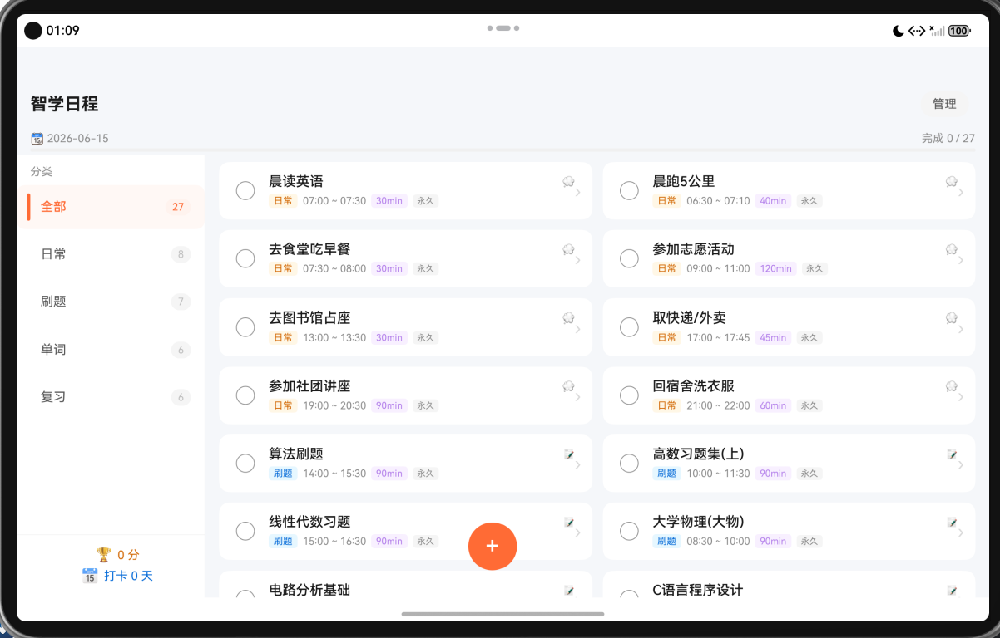
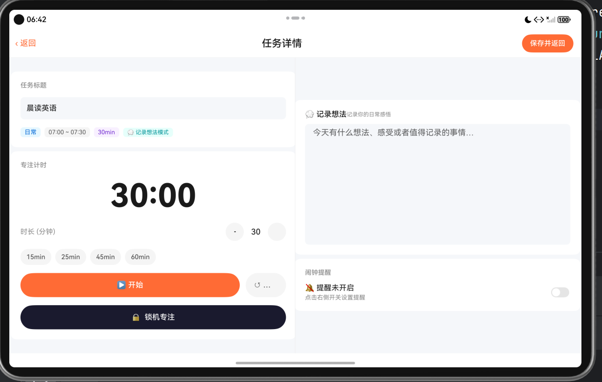
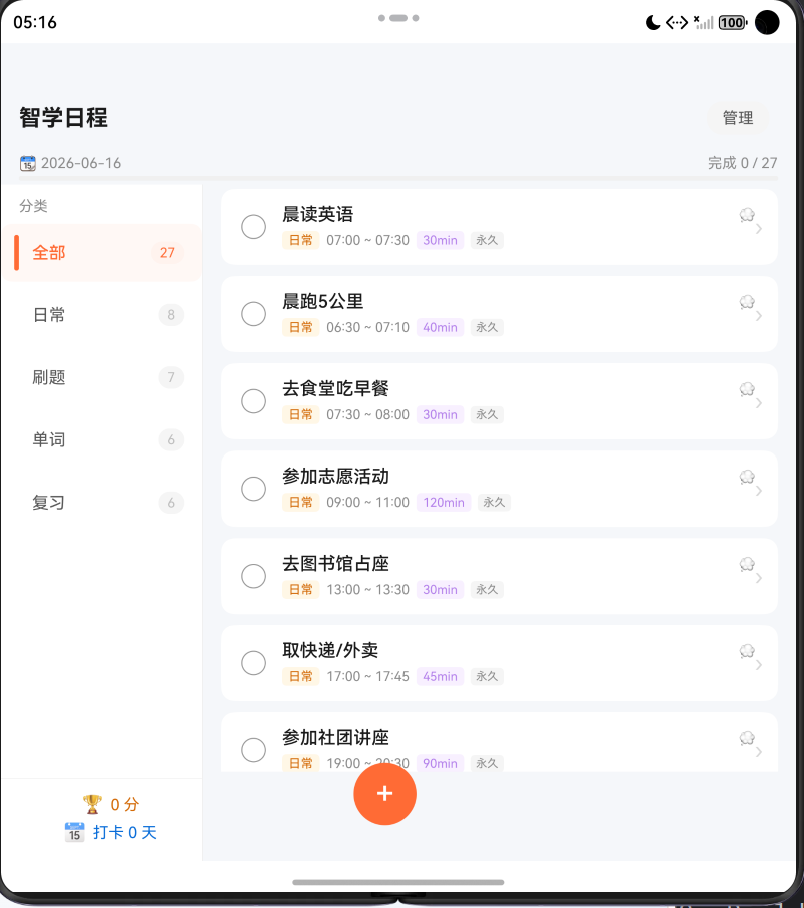
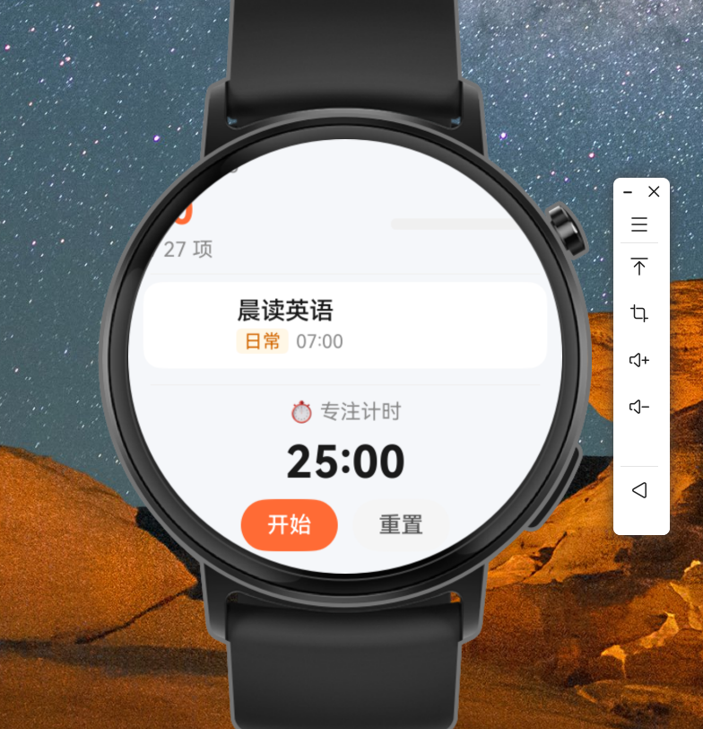
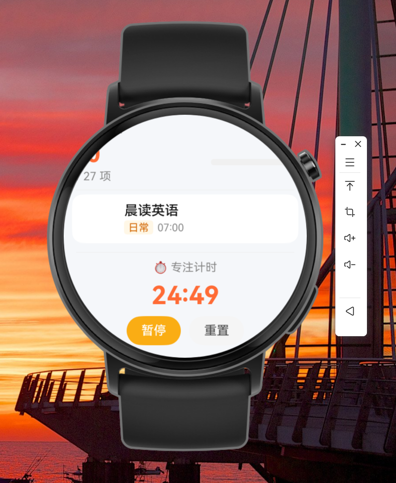

# 智学日程 · SmartStudy Schedule

> 专为大学生打造的 HarmonyOS 学习待办与专注管理 App  
> 基于华为官方 Codelab 待办列表示例二次深度开发

[](https://developer.huawei.com)
[](https://developer.huawei.com/consumer/cn/arkts/)
[](https://developer.huawei.com/consumer/cn/deveco-studio/)
[](LICENSE)

---

## 📖 项目简介

**智学日程（SmartStudy Schedule）** 是一款面向大学生日常学习生活场景深度定制的鸿蒙原生 App。项目在华为官方 Codelab 待办清单示例的基础上，进行了系统性的功能扩展与 UI 重设计，并完整实现了 HarmonyOS **"一次开发，多端部署"**、**"自由流转"** 与 **数据持久化** 三大核心能力。

---

## 🖼 效果展示（手机端）

<table>
  <tr>
    <td align="center">
      
      <br/><sub><b>主页 · 多分类任务列表</b></sub>
    </td>
    <td align="center">
      
      <br/><sub><b>管理模式 · 一键删除任务</b></sub>
    </td>
    <td align="center">
      
      <br/><sub><b>新增待办 · 灵活配置</b></sub>
    </td>
  </tr>
  <tr>
    <td align="center">
      
      <br/><sub><b>日常任务 · 记录想法</b></sub>
    </td>
    <td align="center">
      
      <br/><sub><b>学习任务 · 笔记+资料</b></sub>
    </td>
    <td align="center">
      
      <br/><sub><b>锁机专注 · 沉浸计时</b></sub>
    </td>
  </tr>
</table>

---

## 📱 多端部署效果展示

<table>
  <tr>
    <td align="center">
      
      <br/><sub><b>平板 · 侧边栏 + 双列卡片网格</b></sub>
    </td>
    <td align="center">
      
      <br/><sub><b>平板 · 详情页左右分栏布局</b></sub>
    </td>
  </tr>
  <tr>
    <td align="center">
      
      <br/><sub><b>折叠屏展开 · 侧边栏 + 单列列表</b></sub>
    </td>
    <td align="center">
      
      <br/><sub><b>智能手表 · 极简任务列表</b></sub>
    </td>
    <td align="center">
      
      <br/><sub><b>智能手表 · 番茄钟计时</b></sub>
    </td>
  </tr>
</table>

---

## ✨ 核心功能

### 1. 多分类待办管理

任务划分为**日常 / 刷题 / 单词 / 复习**四大类，支持顶部 Tab 切换，预置符合大学生场景的典型任务。

### 2. 自定义任务新增 · 灵活存在时间

点击 **+** 从底部弹出新增面板，存在时间三档可选：

| 模式 | 说明 |
|------|------|
| 📅 仅今天 | 当日显示，次日自动消失 |
| 🔁 永久固定 | 每天显示，直到手动删除 |
| 📆 自定义范围 | 指定开始和结束日期，适合备考计划 |

### 3. 笔记分类 · 智能切换

| 任务类型 | 笔记模式 |
|---------|---------|
| 刷题 / 单词 / 复习 | 📝 学习笔记 + 📎 导入学习资料 |
| 日常 | 💭 记录想法日记 |

### 4. 专注计时 · 锁机沉浸模式

快捷时长选择（15/25/45/60 分钟），**🔒 锁机专注**进入全屏深色界面，屏蔽干扰，专注完成自动标记。

### 5. 闹钟振动提醒

基于 `reminderAgentManager` 代理提醒，**App 退出后依然有效**，振动+通知双重提醒。

### 6. 积分打卡激励

完成日常任务 +5 分，学习类任务 +10 分，每日首次打卡 +20 分。

---

## 💾 数据持久化

基于 HarmonyOS `@ohos.data.preferences` 实现本地持久化存储，**App 重启或重新部署后数据不丢失**。

| 存储内容 | 存储 Key | 说明 |
|---------|---------|------|
| 用户新增任务 | `user_tasks` | 完整任务对象（标题、分类、时间、存在周期等），JSON 数组存储 |
| 任务完成状态 | `completed_ids` | 已完成任务的 ID 列表（含预设27个任务与用户新增任务） |

### 持久化触发时机

| 操作 | 行为 |
|------|------|
| 新增任务 | 立即写入 `user_tasks` |
| 删除任务 | 重新写入 `user_tasks` 与 `completed_ids` |
| 勾选/取消完成 | 实时更新 `completed_ids` |
| App 启动 | `aboutToAppear()` 中异步读取并合并到内存任务列表 |

预设的27个任务本身不重复存储（避免冗余），仅持久化其**完成状态**；用户新增任务（ID 由 `Date.now()` 生成，大于 `100000000`）完整持久化标题、时间、分类、存在周期等全部字段。

---

## 📱 一次开发，多端部署

基于断点系统监听屏幕宽度（`display.getDefaultDisplaySync()` 计算 vp + `window.on('windowSizeChange')` 监听折叠/旋转），自动切换最适合当前设备的布局。

| 断点 | 宽度 | 设备 | 布局策略 |
|------|------|------|---------|
| `xs` | < 280vp | ⌚ 智能手表 | 极简任务列表 + 简单计时 |
| `sm` | 280~599vp | 📱 手机 / 折叠屏折叠态 | 单列列表 + Tab 分类栏 |
| `md` | 600~839vp | 📱 折叠屏展开态 | 左侧分类侧边栏 + 右侧单列列表 |
| `lg` | ≥ 840vp | 📟 平板 | 左侧侧边栏 + 右侧**双列卡片网格** |

**详情页平板专属布局：** 左栏（任务信息 + 专注计时控制）/ 右栏（学习笔记 / 记录想法 + 学习资料 + 闹钟提醒）。

**手表端界面：** 顶部日期和积分、进度条、仅显示未完成任务（任务名+分类标签+开始时间）、底部番茄钟（开始/暂停/重置）。

---

## 🔄 自由流转（跨端迁移）

基于 HarmonyOS **分布式流转框架**，用户可一键将当前使用状态从手机迁移到平板（或其他设备），实现无缝接续。

### 迁移的状态

| 状态 | 说明 |
|------|------|
| 当前 Tab 分类 | 恢复到相同的任务分类 |
| 当前页面 | 若在详情页，自动跳转到对应任务 |
| 专注计时进度 | 恢复剩余秒数，误差 ≤5 秒 |
| 笔记内容 | 恢复正在编辑的笔记 |

### 实现原理

```
源端（手机）触发流转
      ↓
onContinue() 保存状态到 wantParam
      ↓
对端（平板）onCreate() / onNewWant() 恢复状态到 AppStorage
      ↓
ToDoListPage 恢复 Tab + 自动跳转详情页
TaskDetailPage 恢复计时进度 + 笔记内容
```

### 配置要求

`module.json5` 中需声明：
```json
"continuable": true,
"requestPermissions": [
  {
    "name": "ohos.permission.DISTRIBUTED_DATASYNC",
    "reason": "用于在多设备间同步任务数据，实现自由流转",
    "usedScene": { "abilities": ["EntryAbility"], "when": "inuse" }
  }
]
```

> 自由流转需要两台设备（或模拟器）同时在线，通过系统流转入口触发，而非重新运行 App。

---

## 🛠 技术栈

| 技术 | 说明 |
|------|------|
| **开发语言** | ArkTS（HarmonyOS 声明式语法） |
| **开发工具** | DevEco Studio 6.0+ |
| **目标系统** | HarmonyOS 5.0+ |
| **UI 范式** | 声明式 UI — `@Component` / `@Entry` / `@Builder` |
| **状态管理** | `@State` / `@StorageProp` / `AppStorage` |
| **断点响应** | `@ohos.display` + `@ohos.window` + `@ohos.mediaquery` |
| **页面路由** | `@ohos.router` |
| **本地提醒** | `@ohos.reminderAgentManager`（后台有效） |
| **数据持久化** | `@ohos.data.preferences` |
| **自由流转** | `AbilityConstant.OnContinueResult` / `wantParam` |

---

## 📁 项目结构

```
entry/src/main/ets/
├── common/
│   └── BreakpointSystem.ets   # 断点系统（xs/sm/md/lg 监听）
├── entryability/
│   ├── EntryAbility.ets       # 应用入口 + 自由流转 onContinue 实现
│   └── Task.ets               # 任务数据模型 + JSON 序列化（持久化用）
└── pages/
    ├── ToDoListPage.ets       # 主页：多端布局 + 持久化 + 流转恢复
    └── TaskDetailPage.ets     # 详情页：笔记/计时 + 流转恢复
```

---

## 🚀 运行方式

```bash
git clone https://github.com/OSSD-Course-SYSU-2/2026Spring-25307161-Lab1.git
# 用 DevEco Studio 6.0+ 打开，连接模拟器或真机，Shift+F10 运行
```

> 首次运行需允许权限：`PUBLISH_AGENT_REMINDER`、`VIBRATE`、`DISTRIBUTED_DATASYNC`

---

## 🔄 相比原始 Codelab 的改进

| 功能点 | 原始 Codelab | 智学日程 |
|--------|-------------|---------|
| 任务分类 | 无 | 四分类 + Tab 切换 |
| 任务新增/删除 | 无 | 完整配置 + 管理模式 |
| 任务存在周期 | 无 | 仅今天/永久/自定义范围 |
| 笔记功能 | 无 | 学习笔记+资料 / 记录想法 |
| 专注计时 | 无 | 倒计时 + 锁机沉浸 |
| 闹钟提醒 | 无 | 振动+通知，后台有效 |
| 积分激励 | 无 | 完成得分 + 每日打卡 |
| 数据持久化 | 无 | Preferences 本地存储，重启不丢失 |
| 多端部署 | 无 | Phone/Foldable/Tablet/Wearable |
| 自由流转 | 无 | 全状态迁移（计时+笔记） |

---

## 👨‍💻 开发者

| 信息 | 内容 |
|------|------|
| 学号 | 25307161 |
| 课程 | 开源软件开发 2026 Spring |
| 学校 | 中山大学（SYSU） |
| 基础项目 | [HarmonyOS 官方 Codelab · 待办清单](https://developer.huawei.com/consumer/cn/codelabsPortal/carddetails/tutorials_Next-GettingStarted-ArkTS-todo) |

---

<div align="center">
  <sub>Built with ❤️ on HarmonyOS · ArkTS</sub>
</div>

---

# ─────────────────────────────────────
# English Version · 英文版
# ─────────────────────────────────────

# SmartStudy Schedule · 智学日程

> A HarmonyOS App for college students — task management, focus timer & study notes, all in one.  
> Built upon Huawei's official Codelab To-Do List sample with extensive feature enhancements.

[](https://developer.huawei.com)
[](https://developer.huawei.com/consumer/cn/arkts/)
[](https://developer.huawei.com/consumer/cn/deveco-studio/)
[](LICENSE)

---

## 📖 Overview

**SmartStudy Schedule** is a HarmonyOS-native App deeply customized for college students' daily academic life. It fully implements three HarmonyOS flagship capabilities: **"Develop Once, Deploy Everywhere"**, **"Free Continuation"** (cross-device state migration), and **local data persistence**.

---

## 🖼 Screenshots (Phone)

<table>
  <tr>
    <td align="center">
      
      <br/><sub><b>Home · Multi-category Task List</b></sub>
    </td>
    <td align="center">
      
      <br/><sub><b>Manage Mode · Delete Any Task</b></sub>
    </td>
    <td align="center">
      
      <br/><sub><b>Add Task · Full Configuration</b></sub>
    </td>
  </tr>
  <tr>
    <td align="center">
      
      <br/><sub><b>Daily Task · Record Thoughts</b></sub>
    </td>
    <td align="center">
      
      <br/><sub><b>Study Task · Notes + Materials</b></sub>
    </td>
    <td align="center">
      
      <br/><sub><b>Lock-Screen Focus Mode</b></sub>
    </td>
  </tr>
</table>

---

## 📱 Multi-Device Deployment Showcase

<table>
  <tr>
    <td align="center">
      
      <br/><sub><b>Tablet · Sidebar + Two-Column Card Grid</b></sub>
    </td>
    <td align="center">
      
      <br/><sub><b>Tablet · Detail Page Split Layout</b></sub>
    </td>
  </tr>
  <tr>
    <td align="center">
      
      <br/><sub><b>Foldable (Unfolded) · Sidebar + List</b></sub>
    </td>
    <td align="center">
      
      <br/><sub><b>Smartwatch · Minimal Task List</b></sub>
    </td>
    <td align="center">
      
      <br/><sub><b>Smartwatch · Pomodoro Timer</b></sub>
    </td>
  </tr>
</table>

---

## 💾 Data Persistence

Implemented with HarmonyOS `@ohos.data.preferences` for local storage — **data survives App restarts and redeployments**.

| Content | Storage Key | Detail |
|---------|-------------|--------|
| User-added tasks | `user_tasks` | Full task objects stored as JSON array |
| Completion status | `completed_ids` | List of completed task IDs (presets + user tasks) |

Persistence is triggered on: task creation, deletion, and completion toggle. Data is loaded asynchronously in `aboutToAppear()` and merged with the in-memory preset task list at startup.

---

## 📱 Develop Once, Deploy Everywhere

A breakpoint system (`display.getDefaultDisplaySync()` + `window.on('windowSizeChange')`) monitors real screen width and automatically switches layouts.

| Breakpoint | Width | Device | Layout |
|------------|-------|--------|--------|
| `xs` | < 280vp | ⌚ Wearable | Minimal task list + simple timer |
| `sm` | 280~599vp | 📱 Phone / Folded | Single column + Tab bar |
| `md` | 600~839vp | 📱 Foldable (unfolded) | Side category bar + task list |
| `lg` | ≥ 840vp | 📟 Tablet | Side bar + **two-column card grid** |

**Tablet detail page**: left column (task info + focus timer) / right column (notes + materials + alarm).

---

## 🔄 Free Continuation (Cross-Device Migration)

Users can seamlessly transfer the current session from phone to tablet with one tap, migrating Tab category, current page, focus timer progress (±5s accuracy), and note content.

```
Source device (phone) triggers continuation
      ↓
onContinue() packs state into wantParam
      ↓
Target device (tablet) onCreate() / onNewWant() restores to AppStorage
      ↓
ToDoListPage restores Tab + auto-navigates to detail
TaskDetailPage restores timer seconds + note content
```

> Free Continuation requires both devices online simultaneously, triggered via the system's continuation entry point — not by relaunching the App.

---

## ✨ Key Features

- **Multi-category tasks** — Daily / Practice / Vocabulary / Review with Tab switching
- **Flexible scheduling** — Today only / Permanent / Custom date range
- **Smart notes** — Study notes + materials import for study tasks; thought journal for daily tasks
- **Focus timer** — Countdown + immersive lock-screen mode
- **Alarm reminders** — Vibration + notification via `reminderAgentManager`, background-safe
- **Points system** — Task completion rewards + daily check-in
- **Data persistence** — Local storage via `@ohos.data.preferences`

---

## 🛠 Tech Stack

| Technology | Details |
|------------|---------|
| **Language** | ArkTS (HarmonyOS Declarative) |
| **IDE** | DevEco Studio 6.0+ |
| **Target OS** | HarmonyOS 5.0+ |
| **Responsive Layout** | `@ohos.display` + `@ohos.window` + `@ohos.mediaquery` |
| **Reminders** | `@ohos.reminderAgentManager` (background-safe) |
| **Persistence** | `@ohos.data.preferences` |
| **Free Continuation** | `AbilityConstant.OnContinueResult` / `wantParam` |

---

## 📁 Project Structure

```
entry/src/main/ets/
├── common/
│   └── BreakpointSystem.ets   # Breakpoint listener (xs/sm/md/lg)
├── entryability/
│   ├── EntryAbility.ets       # App entry + onContinue for free continuation
│   └── Task.ets               # Task data model + JSON serialization
└── pages/
    ├── ToDoListPage.ets       # Home: multi-device layout + persistence + continuation
    └── TaskDetailPage.ets     # Detail: notes/timer + continuation restore
```

---

## 🚀 Getting Started

```bash
git clone https://github.com/OSSD-Course-SYSU-2/2026Spring-25307161-Lab1.git
# Open in DevEco Studio 6.0+, connect device, press Shift+F10
# Allow PUBLISH_AGENT_REMINDER / VIBRATE / DISTRIBUTED_DATASYNC on first launch
```

---

## 🔄 Improvements over Original Codelab

| Feature | Original | SmartStudy Schedule |
|---------|----------|---------------------|
| Task management | Basic list | Full CRUD + categories |
| Notes | None | Smart type-adaptive notes |
| Focus timer | None | Countdown + lock-screen |
| Alarm | None | Background-safe vibration+notification |
| Data persistence | None | Local storage, survives restarts |
| Multi-device | Phone only | Phone / Foldable / Tablet / Wearable |
| Free Continuation | None | Full state migration (timer + notes) |

---

## 👨‍💻 Developer

| Field | Info |
|-------|------|
| Student ID | 25307161 |
| Course | Open Source Software Development · 2026 Spring |
| University | Sun Yat-sen University (SYSU) |
| Base Project | [HarmonyOS Official Codelab · To-Do List](https://developer.huawei.com/consumer/cn/codelabsPortal/carddetails/tutorials_Next-GettingStarted-ArkTS-todo) |

---

<div align="center">
  <sub>Built with ❤️ on HarmonyOS · ArkTS</sub>
</div>
